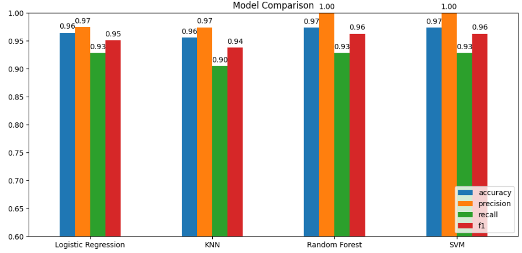

# 🧬 **Breast Cancer Classification using Machine Learning**

Machine learning project to classify breast tumors as **benign** or **malignant** using multiple classification algorithms.

This project covers the full workflow: from exploratory data analysis (EDA) to model training, evaluation, and interpretation.

## 📌 Project Overview
- Performed exploratory data analysis to understand the dataset
- Applied preprocessing techniques including feature scaling
- Trained and compared 4 classification models (Logistic Regression, KNN, Random Forest, SVM)
- Evaluated performance using multiple metrics
- Analyzed feature importance to interpret model behavior

## 📊 Key Results
- All models achieved strong predictive performance
- **Random Forest and SVM** showed the best overall results
- Emphasis was placed on **recall**, due to its importance in medical diagnosis
- High recall helps reduce **false negatives**, which is critical when detecting cancer

## 🧠 Key Insights

Feature importance analysis revealed that:
 Variables related to tumor size (e.g., radius, perimeter, area), specially their **worst values**, have the strongest impact on predictions.

👉 In line with domain knowledge: larger and more irregular tumors are more likely to be malignant.

## 🛠️ Tech Stack
Python | Pandas | NumPy | Scikit-learn | Matplotlib | Seaborn

